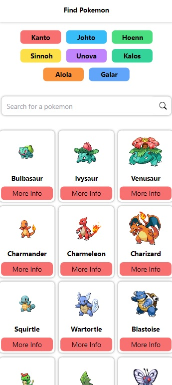
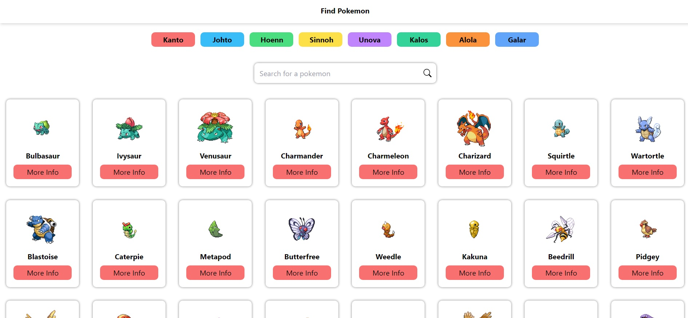

# 🔏 Find Pokemon 

    
     

---

## 💡 Description

Project to obtain certificate of **Asynchronism with JavaScript** from **Platzi**.
The challenge is to build a web page using an API, applying everything learned during the course.

---

## 🔑 Key technologies to develop the project

- HTML
- JAVASCRIPT
- CSS
- NPM
- TAILWIND

